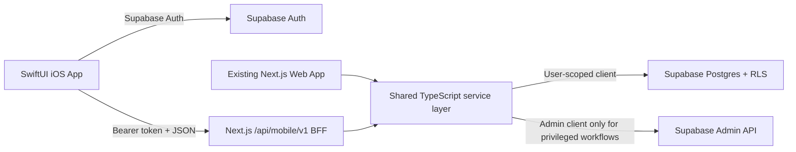

# FamilyLedger iOS App Implementation Plan

## 1. Goal

Build a native SwiftUI iOS app that gives existing FamilyLedger users access to the same household financial data as the web app. The iOS app will share the existing Supabase Auth project and Postgres database, preserve the current household authorization model, and keep all financial data access behind trusted server-side endpoints.

The first release should optimize the most frequent mobile workflow: quickly recording and reviewing household transactions. It should not attempt to reproduce every desktop layout directly.

## 2. Product Decisions

- Build a native SwiftUI app, not a web view wrapper.
- Target iOS 17 or later so the app can use SwiftUI Observation, Swift Charts, and modern navigation APIs.
- Support iPhone first and make every screen adapt cleanly to iPad and landscape layouts.
- Use Indonesian formatting throughout:
  - Currency: `IDR`, displayed with Indonesian Rupiah formatting.
  - Locale: `id_ID`.
  - Dates and times: Indonesian-friendly display with ISO values in API payloads.
- Continue manual financial entry only. Do not connect to bank APIs.
- Use the existing Supabase project and schema as the system of record.
- Use Supabase Auth from the iOS client with the publishable key. Never include a secret or service-role key in the app.
- Keep financial and household data access server-side through a versioned mobile backend-for-frontend API.
- Preserve existing web behavior and validation rules unless an intentional product change is documented.

## 3. Recommended Release Scope

### Release 1: Mobile Core

Release 1 should include:

- Email/password sign in, sign up, password reset, and sign out.
- Create a household or join one by invite code.
- Dashboard summary.
- Transaction list, search, filters, pagination, create, edit, delete, and account transfers.
- Accounts list grouped into Shared and per-member sections.
- Budgets for a selected month.
- Savings goals.
- Profile and household settings.

This release makes the app useful for daily financial entry without requiring every administrative feature.

### Release 1.1: Management and Analysis

- Account create, edit, and guarded delete.
- Category create, edit, and delete-impact confirmation.
- Family members, member summaries, and owner-only member management.
- Full reports with date-range controls and charts.

### Later Releases

- Supabase Realtime refresh across devices.
- Widgets for balance, monthly spending, and budget status.
- App Intents and Shortcuts for quick transaction entry.
- Local notifications for budget thresholds or goal due dates.
- CSV import/export handoff.
- Optional dark theme.

## 4. Architecture

### 4.1 High-Level Flow



### 4.2 Why Use a Backend-for-Frontend

The repository requires server-side data access. The existing web app also contains important server-only behavior that must not be duplicated or weakened in the iOS client:

- Creating and joining households uses the admin client.
- Creating default categories uses the admin client.
- Adding a family member may create an Auth user with the admin client.
- Account, goal, transaction, and delete-impact flows contain validation beyond database constraints.
- The service-role key must never be shipped in an iOS binary.

The iOS app should call versioned JSON endpoints under `/api/mobile/v1`. Route handlers validate the Supabase access token, create a user-scoped Supabase client so RLS still applies, and call shared TypeScript domain services. Privileged operations may use the admin client only after explicit authorization checks.

### 4.3 API Contract

Create an OpenAPI document before implementing screens. Generate or manually maintain matching Swift request and response models.

Initial endpoints:

| Area | Endpoints |
| --- | --- |
| Session bootstrap | `GET /api/mobile/v1/bootstrap` |
| Household onboarding | `POST /api/mobile/v1/households`, `POST /api/mobile/v1/households/join` |
| Dashboard | `GET /api/mobile/v1/dashboard?month=YYYY-MM` |
| Transactions | `GET/POST /api/mobile/v1/transactions`, `PATCH/DELETE /api/mobile/v1/transactions/{id}` |
| Accounts | `GET/POST /api/mobile/v1/accounts`, `PATCH/DELETE /api/mobile/v1/accounts/{id}` |
| Budgets | `GET/POST /api/mobile/v1/budgets`, `PATCH/DELETE /api/mobile/v1/budgets/{id}` |
| Goals | `GET/POST /api/mobile/v1/goals`, `PATCH/DELETE /api/mobile/v1/goals/{id}` |
| Categories | `GET/POST /api/mobile/v1/categories`, `PATCH/DELETE /api/mobile/v1/categories/{id}` |
| Family | `GET/POST /api/mobile/v1/members`, `PATCH/DELETE /api/mobile/v1/members/{id}` |
| Reports | `GET /api/mobile/v1/reports?from=YYYY-MM-DD&to=YYYY-MM-DD` |
| Settings | `PATCH /api/mobile/v1/profile`, `PATCH /api/mobile/v1/household` |

API rules:

- Use JSON with camel-case fields matching existing TypeScript domain types.
- Send dates as `YYYY-MM-DD`, times as `HH:mm`, and months as `YYYY-MM`.
- Send money as numeric decimal values, never formatted strings.
- Return a consistent error envelope with `code`, `message`, and optional `fieldErrors`.
- Use cursor pagination for transactions.
- Make create/update responses return the saved resource.
- Return delete-impact data before destructive account/category operations.
- Version breaking changes under a new `/api/mobile/vN` path.

### 4.4 Swift App Structure

Create the Xcode project in `ios/FamilyLedger/`.

```text
ios/FamilyLedger/
  App/
    FamilyLedgerApp.swift
    AppRootView.swift
    AppEnvironment.swift
    AppRouter.swift
  Core/
    API/
    Auth/
    DesignSystem/
    Formatting/
    Models/
    Validation/
  Features/
    Authentication/
    Onboarding/
    Dashboard/
    Transactions/
    Accounts/
    Budgets/
    Goals/
    Reports/
    Family/
    Categories/
    Settings/
  Resources/
  FamilyLedgerTests/
  FamilyLedgerUITests/
```

Use these implementation patterns:

- `@Observable` app session owned by the root view.
- Shared `AuthService`, `APIClient`, and app configuration injected through `@Environment`.
- Feature-local state kept in each feature's model or view.
- One `NavigationStack` per tab to preserve independent navigation history.
- Enum-driven routes and sheets instead of multiple presentation booleans.
- Async loading with explicit loading, empty, loaded, and error states.
- Protocol-backed services for unit tests and SwiftUI previews.

### 4.5 Navigation

Use five primary tabs:

1. **Home**: dashboard, recent transactions, summary cards.
2. **Transactions**: searchable and filterable transaction history.
3. **Plan**: budgets and savings goals, using a segmented control.
4. **Accounts**: shared and private accounts.
5. **More**: reports, family, categories, profile, household settings, and sign out.

Use a persistent central or toolbar-level **Add Transaction** action where it remains accessible without crowding the tab bar.

App root states:

```text
Launching -> Signed Out -> Signed In Without Household -> Signed In With Household
```

Reset all tab navigation when the user signs out or the active household changes.

## 5. Native Screen Plan

### Authentication and Onboarding

- Recreate email/password login and signup with native fields and validation.
- Support password-reset deep links using a registered app URL scheme or universal link.
- After authentication, load the bootstrap endpoint.
- If no active household exists, show create and join options.
- Format invite codes as users type them and allow copy/share from household settings.

### Dashboard

- Show total balance, monthly income, monthly expenses, and savings rate.
- Use horizontally scrollable summary cards on compact widths and a grid on iPad.
- Use Swift Charts for cashflow and spending breakdown.
- Show budget and savings-goal progress.
- Show the five most recent transactions and a route to the full list.
- Pull to refresh and refresh after successful mutations.

### Transactions

- Group rows by transaction date.
- Show income, expense, and transfer states clearly without relying only on color.
- Add debounced search and server-backed filters for date range, type, category, member, and account.
- Use cursor pagination and load more near the end of the list.
- Present create/edit as an enum-driven sheet.
- Default the family member to the signed-in household member.
- For transfers, require different source and destination accounts.
- After mutations, invalidate dashboard, account, budget, goal, report, and transaction data.

### Accounts

- Group accounts into Shared and per-member sections.
- Show computed balance and account type.
- Account editing must validate owner membership and non-negative opening balance.
- Before delete, load impact data. Block deletion when transactions are linked and explain that linked savings goals will be removed.

### Budgets and Goals

- Budgets use a native month selector and expense categories only.
- Show limit, spent, remaining, and percentage used.
- Savings goals only link to Savings accounts.
- Derive displayed saved amount from the linked account balance, matching current web behavior.
- Prevent duplicate goals for the same savings account.

### Reports

- Use Swift Charts for income vs expense, net cashflow, category spending, and member spending.
- Provide accessible text summaries for every chart.
- Start with the current 12-month behavior, then add date-range controls in Release 1.1.

### Family, Categories, and Settings

- Hide owner-only actions for members and enforce the same rule on the server.
- Family member creation remains a privileged server-side operation.
- Category deletion must explain transaction and budget impact.
- Profile updates change Supabase Auth metadata through the trusted API or a tightly scoped auth service.
- Household name changes are owner-only.

## 6. Design System and Accessibility

Translate `DESIGN.md` into native semantic tokens:

- Brand lime: `#9FE870`.
- Near-black ink: `#0E0F0C`.
- Sage surface: `#E8EBE6`.
- Positive, warning, and negative semantic colors.
- Rounded cards and pill-shaped primary actions.

Implementation requirements:

- Use Dynamic Type and avoid fixed-height text containers.
- Use semantic colors and support increased contrast.
- Maintain at least 44-point interactive targets.
- Add VoiceOver labels, values, and hints to charts, icon buttons, progress indicators, and transaction amounts.
- Never communicate income/expense status with color alone.
- Support Reduce Motion.
- Verify layouts on a small iPhone, a current standard iPhone, and iPad.

## 7. Data, Security, and Consistency Work

Before exposing mobile endpoints:

- Refactor reusable validation and data-access logic out of Next.js server actions into shared server-only modules.
- Keep `SUPABASE_SERVICE_ROLE_KEY` and future secret keys server-side only.
- Validate the bearer token on every mobile API request.
- Use the authenticated user's JWT for normal Supabase queries so existing RLS remains active.
- Perform explicit owner checks before privileged mutations.
- Review RLS policies and database functions before launch.
- Add request rate limits to auth-adjacent and invite-code endpoints.
- Add structured audit logging for privileged operations.
- Return stable domain error codes instead of exposing raw database errors.
- Add contract tests proving web and iOS operations produce equivalent results.

Known backend issues to resolve during the API phase:

- Household onboarding currently relies on admin-side multi-step operations without a database transaction. Make create/join behavior atomic or safely retryable.
- `getActiveHousehold` chooses the first membership rather than storing an explicit active household. Confirm that one-household-per-user remains the intended product rule.
- Dashboard and goals currently contain two different savings-goal linking strategies. Standardize on `savings_goals.account_id`.
- Some business validation only exists in Next.js actions. Move it into shared server-only domain services so mobile cannot bypass it.
- Confirm obsolete debt-related RLS statements are removed or intentionally retained after the debt tables were dropped.

## 8. Delivery Phases

### Phase 0: Contract and Backend Readiness

Deliverables:

- Confirm Release 1 scope and iOS deployment target.
- Define OpenAPI schema and consistent error envelope.
- Extract shared server-only domain services from current actions.
- Add authenticated `/api/mobile/v1` bootstrap, dashboard, and transaction endpoints.
- Add endpoint integration tests, RLS checks, and privileged-operation tests.

Exit criteria:

- A valid Supabase access token can bootstrap a household.
- Invalid, expired, and cross-household access is rejected.
- No service-role key or privileged behavior is exposed to the client.

### Phase 1: Native Foundation

Deliverables:

- Create Xcode project, build configurations, bundle identifiers, and SPM dependencies.
- Add Supabase Swift for Auth only.
- Add app configuration without committing production secrets.
- Implement app root state, auth session observer, dependency injection, tab navigation, routing, sheets, design tokens, formatters, API client, and error mapping.
- Add CI build and test commands.

Exit criteria:

- App builds on the selected simulator.
- Login persists across launches.
- Signed-out, onboarding, and signed-in root states route correctly.

### Phase 2: Daily Transaction MVP

Deliverables:

- Dashboard.
- Transaction list, filters, cursor pagination, create, edit, delete, and transfers.
- Read-only account list.
- Pull to refresh, mutation refresh, loading, error, and empty states.

Exit criteria:

- A user can sign in, create or join a household, add a transaction, and see balances and dashboard metrics update.
- Transaction behavior matches the web app for income, expense, and transfer cases.

### Phase 3: Planning Features

Deliverables:

- Budgets and month navigation.
- Savings goals.
- Account management.
- Delete-impact confirmations.

Exit criteria:

- Budget usage and goal progress match web calculations for the same household data.
- Account deletion cannot bypass linked-transaction safeguards.

### Phase 4: Management and Reports

Deliverables:

- Reports and accessible chart summaries.
- Family member views and owner-only management.
- Category management.
- Profile and household settings.

Exit criteria:

- Role-restricted UI and API permissions match.
- Reports match web results for agreed test fixtures.

### Phase 5: Hardening and Release

Deliverables:

- Performance and accessibility audit.
- Offline and poor-network behavior review.
- Crash reporting and privacy-conscious analytics.
- App Store metadata, privacy manifest, screenshots, and TestFlight build.
- Update repository README with iOS setup and development commands.

Exit criteria:

- All automated checks pass.
- Core flows pass on small iPhone, standard iPhone, and iPad simulators.
- TestFlight acceptance checklist passes with a staging Supabase project.

## 9. Testing Strategy

### Backend

- Unit-test shared validation and finance calculations.
- Integration-test every mobile API endpoint.
- Test RLS with two users in different households.
- Test owner/member permission differences.
- Test onboarding retries and partial-failure recovery.
- Test cursor pagination stability.

### iOS Unit Tests

- Rupiah, compact amount, Indonesian date, time, and month formatting.
- Transaction, account, budget, and goal validation.
- API decoding and domain error mapping.
- Dashboard, budget, savings-rate, grouping, and chart calculations.
- Router and session state transitions.

### iOS UI Tests

- Sign in and sign out.
- Create and join household.
- Add income, expense, and transfer transactions.
- Edit and delete transaction.
- Search and filter transactions.
- Create budget and savings goal.
- Owner-only family and settings flows.
- Password reset deep link.

### Required Verification Per Phase

- Web: `npm run lint`, `npm run test`, and `npm run build`.
- iOS: simulator build, unit tests, and focused UI tests.
- Manual mobile-layout check on small iPhone, standard iPhone, and iPad.
- Confirm no unused imports or dead actions.
- Update README whenever user-facing behavior or setup changes.

## 10. Initial Risks

| Risk | Mitigation |
| --- | --- |
| Web and iOS business rules drift | Put shared rules in server-only TypeScript services and test the API contract. |
| Mobile client bypasses validation | Do all financial and household data mutations through the BFF. |
| Service-role key exposure | Keep it only in server environment variables and test built app contents/configuration. |
| Too much scope for first release | Ship transaction-first Release 1, then management and reports. |
| Charts are inaccessible or cramped | Provide text summaries and responsive compact/iPad layouts. |
| Multi-device data becomes stale | Refresh on foreground, pull to refresh, and after mutations; add Realtime later. |
| Existing web behavior is ambiguous | Resolve the known backend consistency items before implementing dependent screens. |

## 11. Definition of Done for the First Public iOS Release

- Existing users can authenticate against the same Supabase project.
- New users can create or join a household.
- Users can complete the core daily transaction workflow.
- Dashboard, balances, budgets, and goals stay consistent with the web app.
- All sensitive operations remain server-side and enforce household authorization.
- Rupiah formatting, responsive layouts, and accessibility requirements are met.
- Web and iOS automated checks pass.
- README contains complete iOS setup, configuration, build, test, and release instructions.
